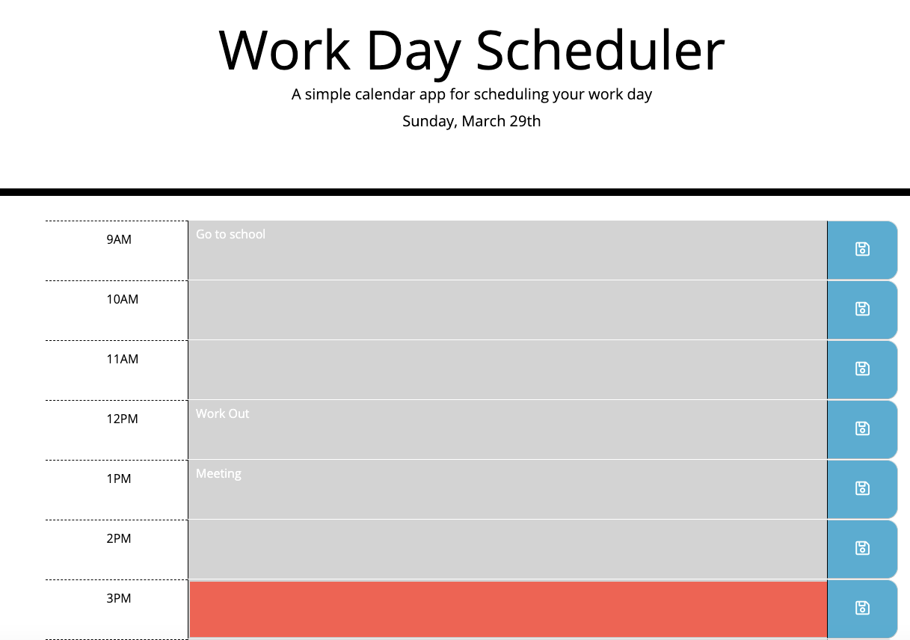

# Work-Day-Scheduler

1) Goals and Methods
- With the power of Bootstrap and Javascript, I have created a work day scheduler that allows the user to keep on track! Please note that in the scheduler, the background of each hour grid will change colors to signify present, past and future hours. Additionally, the user input will stay stored so you can view it when you reload the page! Enjoy!

2) Technologies
- HTML
- CSS
- Bootstrap
- Javascript
- jQuery

3) Installation
- No installation required. Here is the link to the site: https://ksmera01.github.io/Work-Day-Scheduler/

4) Screenshots
